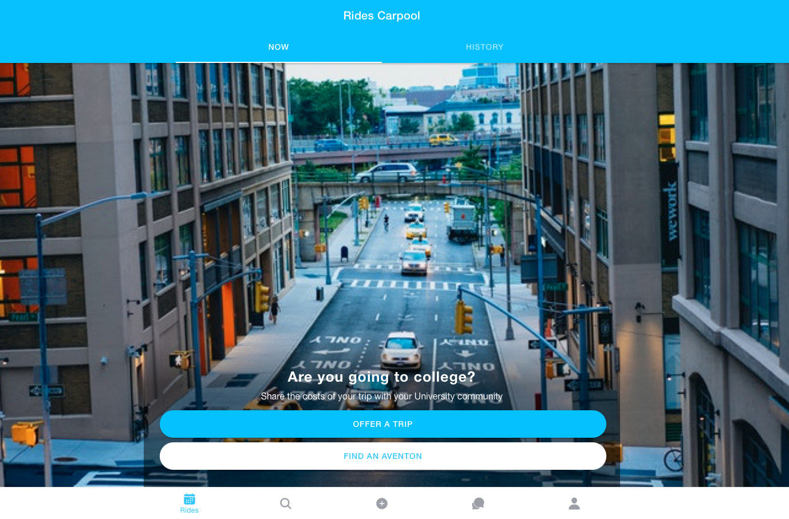

# Rides Carpool App

A comprehensive ridesharing/carpooling mobile application built with Ionic 5 and Angular. Connect University Students from Unisangil University in roles of drivers and passengers for shared rides with real-time mapping, chat functionality, and booking management.

**Note:** This project is no longer actively maintained.

## Screenshots



## Requirements

- Node.js 12.16.1 or higher
- npm or yarn
- Ionic CLI
- Cordova CLI
- Android SDK (for Android builds)
- Xcode (for iOS builds)

## Installation

1. Clone this repository

2. Install dependencies

```bash
npm install
```

3. Add platforms

```bash
iomic cordova platform add android
iomic cordova platform add ios
```

4. Configure API Keys and Firebase

**Important:** API keys are not included in the repository for security. You need to add your own:

- **Google Maps API Key**: Get one from [Google Cloud Console](https://console.cloud.google.com/apis/library/maps-backend.googleapis.com)
- **Firebase Credentials**: Get from your [Firebase Console](https://console.firebase.google.com)

Update the following files with your credentials:
- `src/environments/environment.ts` - Development environment
- `src/environments/environment.prod.ts` - Production environment  
- `src/index.html` - Replace `YOUR_GOOGLE_MAPS_API_KEY` in the script tag

## Build & Run

```bash
# Development
iomic serve

# Build for Android
iomic cordova build android

# Build for iOS
iomic cordova build ios
```

## Features

- Real-time ride matching and booking
- Google Maps integration
- In-app chat messaging
- User profiles and ratings
- Payment processing
- Route optimization
## Architecture

- **Frontend:** Angular + Ionic 5 + TypeScript
- **Backend:** Firebase with Firestore & Authentication  
- **Maps & Location:** Google Maps API, Geolocation services
- **Cross-platform:** iOS and Android via Cordova

## Technology Stack

- Angular 11
- Ionic 5
- TypeScript
- RxJS
- Firebase (Realtime Database & Firestore)
- Google Maps API
- Cordova

## License

MIT